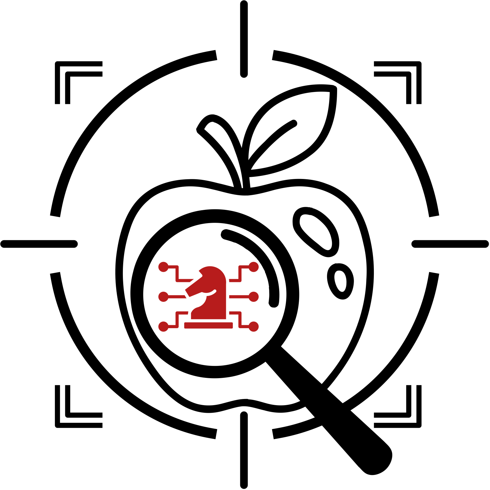

<div align="center">
    
</div>

# ODSCAN: Backdoor Scanning for Object Detection Models


Table of Contents
=================
- [Table of Contents](#table-of-contents)
  - [Overview](#overview)
  - [Code Architecutre](#code-architecture)
  - [Environments](#environments)
  - [Requirement](#requirement)
  - [Train an Object Detection Model with Backdoor](#train-an-object-detection-model-with-backdoor)
    - [Data-poisoning](#data-poisoning)
    - [Training](#training)
    - [Evaluation](#evaluation)
  - [Backdoor Scanning by ODSCAN](#backdoor-scanning-by-odscan)
  - [Citation](#citation)
  - [Acknowledgement](#acknowledgement)

## Overview
- This is the official implementation for IEEE S&P 2024 paper "[ODSCAN: Backdoor Scanning for Object Detection Models](https://ieeexplore.ieee.org/document/10646667)".
- [[paper](https://www.cs.purdue.edu/homes/cheng535/static/papers/sp24_odscan.pdf)\] | [[video](https://www.youtube.com/watch?v=-hPYXKlVSTM)\] | \[[slides](https://www.cs.purdue.edu/homes/cheng535/static/slides/ODSCAN_slides.pdf)\]


## Code Architecture
    .
    ├── adaptived_nc_pixel        # Example baselines on TrojAI dataset
    ├── ckpt                      # Model checkpoints
    ├── data                      # Utilized data
    │   ├── backgrounds           # Background images
    │   ├── forgrounds            # Foreground images
    │   ├── test                  # Test set of synthesis dataset
    │   ├── train                 # Train set of synthesis dataset
    │   ├── triggers              # Trigger patterns
    │   └── fg_class_translation.json  # Image to class translation
    ├── dataset.py                # Dataset functions for training
    ├── poison_data.py            # Data-poisoning functions
    ├── scan_appearing            # Scanner against object appearing attacks
    ├── scan_misclassification    # Scanner against object misclassification attacks
    ├── train.py                  # Model training functions
    └── utils.py                  # Utility functions

## Environments
```bash
# Create python environment (optional)
conda env create -f environment.yml
source activate odscan
```

## Requirement
- Please download the required data from the following link:
[Download Data](https://drive.google.com/file/d/1HqUcXMrrh4gf2l3wPzNN5VnW2DYjgRa1/view?usp=drive_link)
- Once the download is complete, unzip the file in the same directory.


## Train an Object Detection Model with Backdoor
- We use a simplified TrojAI synthesis dataset as an illustrative example for examining backdoor attacks in object detection models.
- This dataset is located in the `./data/train` and `./data/test` folders, which contain five different traffic signs (`./data/foregrounds`) as five objects. The images are created by overlaying traffic signs onto street images (`./data/backgrounds`).
- We employ the SSD300 model as an example model architecture for object detection.
- The code currently supports object misclassification and object appearing attacks.

### Data-poisoning
- Use the following command to generate a poisoned dataset for object misclassification attacks
```bash
# Stamp the trigger on images and modify their annotations
CUDA_VISIBLE_DEVICES="0" python train.py --phase data_poison --data_folder data_poison --trigger_filepath data/triggers/0.png --victim_class 0 --target_class 3 --trig_effect misclassification --location foreground
```

| Arguments | Default Value | Description |
|----------------|---------------|-------------|
| phase | "test" | Specifies the mode of operation. |
| seed | 1024 | Random seed for reproducibility. |
| data_folder | "data_poison" | Directory for storing poisoned data. |
| examples_dir | "data" | Directory of clean data. |
| trigger_filepath | "data/triggers/0.png" | Path of the trigger pattern. |
| victim_class | 0 | Class of the victim object |
| target_class | 0 | Class of the target object |
| trig_effect | "misclassification" | Type of the backdoor attack |
| location | "foreground" | Stamp trigger on foreground or background |
| min_size | 16 | Minimum size of the trigger |
| max_size | 32 | Maximum size of the trigger |
| scale | 0.25 | Scale of the trigger compared to the victim object |

- After the data-poisoning process, the directory `./data_poison` will include a new subfolder `./data_poison/misclassification_foreground_0_3` containing `train` and `test` subdirectories. These specify the poisoned samples for training and testing respectively.
- To generate a poisoned dataset for object appearing attacks, use the following command
```bash
# Stamp the trigger on images and modify their annotations
CUDA_VISIBLE_DEVICES="1" python train.py --trig_effect appearing --location background
```


### Training
- Use the following command to train a poisoned model under object misclassification attacks
```bash
# Train a poisoned model
CUDA_VISIBLE_DEVICES="1" python train.py --phase train
```

| Additional Args | Default Value | Description |
|----------------|---------------|-------------|
| network | "ssd" | Model architecture. |
| num_classes | 5 | Number of classes. |
| epochs | 10 | Total number of training epochs. |
| batch_size | 32 | Batch size. |

- After training, the model will be saved in the `./ckpt` folder under the filename `./ckpt/ssd_poison_misclassification_foreground_0_3.pt`.
- You can also train a clean model using the following command and the model will be saved as `./ckpt/ssd_clean.pt`.
```bash
# Train a clean model
CUDA_VISIBLE_DEVICES="0" python train.py --phase poison
```


### Evaluation
- Use the following command to evaluate the trained model, calculating both the clean Mean Average Precision (mAP) and Attack Success Rate (ASR)
```bash
# Evaluate the model
CUDA_VISIBLE_DEVICES="0" python train.py --phase test
```

- You can also view visualizations of some model predictions in the `./visualize` folder by the following command
```bash
# Visualization of predictions
CUDA_VISIBLE_DEVICES="0" python train.py --phase visual
```


## Backdoor Scanning by ODSCAN
- Scan the model to detect object misclassification or appearing backdoor
```bash
# Detect object misclassification backdoor
CUDA_VISIBLE_DEVICES="0" python scan_misclassification.py --model_filepath ckpt/ssd_poison_misclassification_foreground_0_3.pt

# Detect object appearing backdoor
CUDA_VISIBLE_DEVICES="1" python scan_appearing.py --model_filepath ckpt/ssd_poison_appearing_background_0_3.pt
```


| Critical Args | Default Value | Description |
|----------------|---------------|-------------|
| n_samples | 5 | Number of samples used for scanning |
| trig_len | 32 | Inverted trigger length |
| save_folder | "invert_misclassification" | Directory for saving inverted trigger illustrations |
| iou_threshold | 0.5 | IoU threshold for object location |
| conf_threshold | 0.05 | Confidence threshold to filter out low-confidence anchors |
| epochs | 30 | Total number of steps for trigger inversion |
| topk | 3 | Top-k malicious classes to consider after preprocessing |
| verbose | 1 | Enable saving illustrations and logging details |

- The decision result will be displayed in your command line.
- You can also view the inverted triggers and predictions in the `./invert_misclassification` and `./invert_appearing` directories if you set `verbose` to 1.


## Citation
Please cite our paper if you find it useful for your research.😀

```bibtex
@inproceedings{cheng2024odscan,
    title={ODSCAN: Backdoor Scanning for Object Detection Models},
    author={Cheng, Siyuan and Shen, Guangyu and Tao, Guanhong and Zhang, Kaiyuan and Zhang, Zhuo and An, Shengwei and Xu, Xiangzhe and Liu, Yingqi and Ma, Shiqing and Zhang, Xiangyu},
    booktitle={2024 IEEE Symposium on Security and Privacy (SP)},
    pages={119--119},
    year={2024},
    organization={IEEE Computer Society}
}
```

## Acknowledgement
- [TrojAI Round-10](https://pages.nist.gov/trojai/docs/object-detection-jul2022.html#object-detection-jul2022)
- [TrojAI Round-13](https://pages.nist.gov/trojai/docs/object-detection-feb2023.html#object-detection-feb2023)
- [Django](https://github.com/PurduePAML/DJGO)
